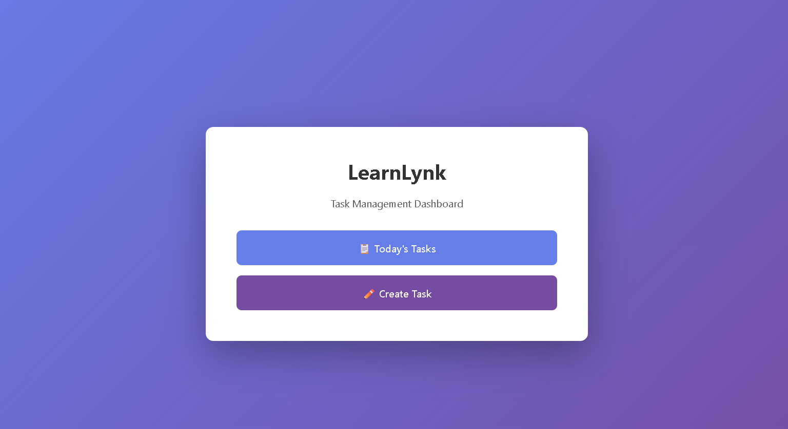
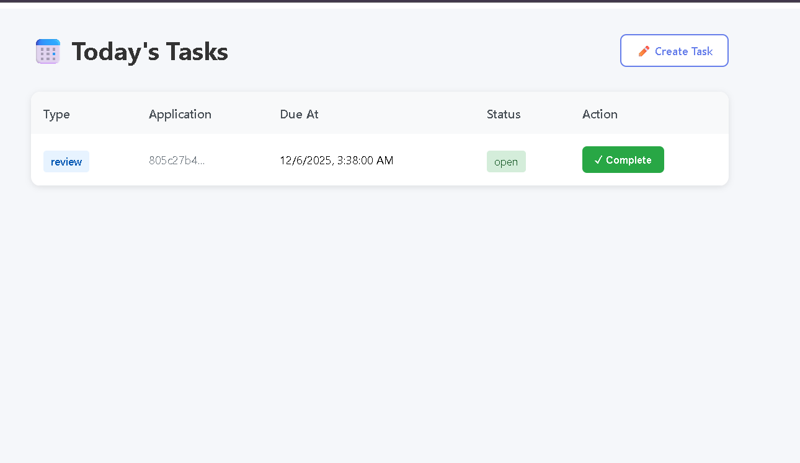
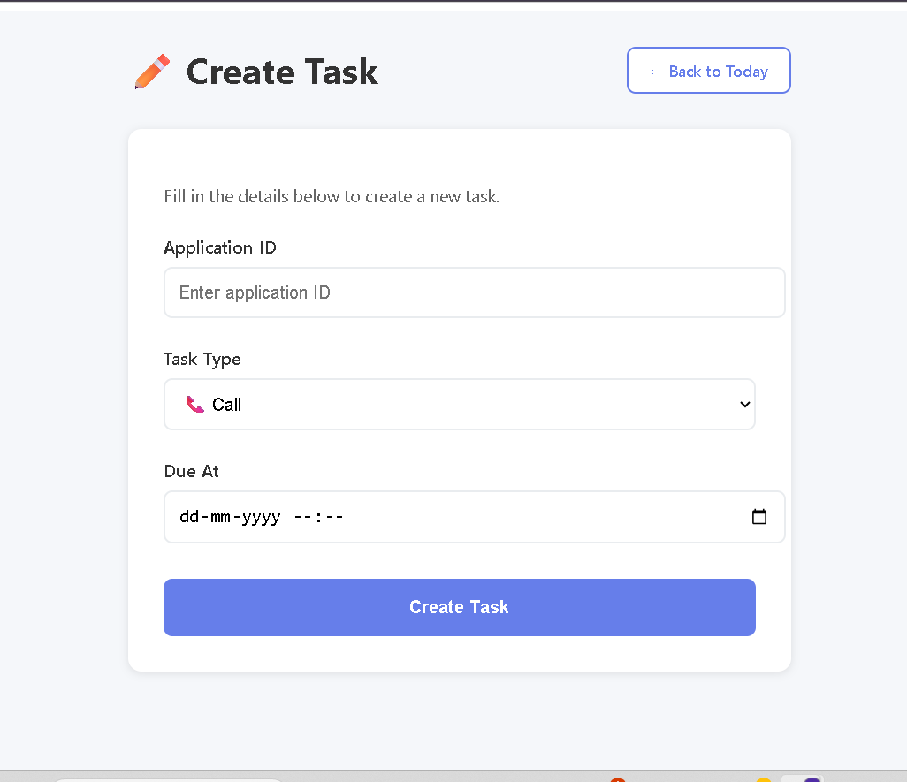

# Implementation Documentation

## Overview

This document outlines the implementation details, architectural decisions, and setup instructions for the LearnLynk technical assessment. The project demonstrates a task management system built with Supabase Postgres, Edge Functions, and Next.js.

## Stripe Answer

To implement a Stripe Checkout flow for an application fee:

1. **Create Payment Request**: When a user initiates payment (e.g., clicking "Pay Application Fee"), insert a row into `payment_requests` table with fields: `id`, `application_id`, `amount`, `currency`, `status='pending'`, `created_at`. This creates an audit trail before calling Stripe.

2. **Call Stripe Checkout**: Use the Stripe API to create a Checkout Session with `mode='payment'`, passing the amount, success/cancel URLs, and metadata (`application_id`, `payment_request_id`). Store the returned `session_id` in the `payment_requests` row along with `stripe_checkout_session_id` field.

3. **Redirect User**: Send the user to the Stripe Checkout URL (`session.url`). They complete payment on Stripe's hosted page.

4. **Handle Webhooks**: Set up an endpoint to receive Stripe webhooks, specifically `checkout.session.completed`. Verify the webhook signature using the signing secret. Extract `payment_intent_id` and metadata from the event payload, then update `payment_requests` with `status='completed'`, `stripe_payment_intent_id`, and `paid_at` timestamp.

5. **Update Application**: In the webhook handler, after confirming payment success, update the `applications` table setting `payment_status='paid'` and `paid_at` timestamp for the corresponding `application_id`. This unlocks the application for processing. Use database transactions to ensure both `payment_requests` and `applications` are updated atomically, preventing inconsistencies if errors occur.


## Screenshots

### Home Page

*Landing page with navigation to Today's Tasks and Create Task*

### Today's Tasks Dashboard

*Dashboard displaying all tasks due today with completion functionality*

### Create Task Form

*Form to create new tasks with application ID, task type, and due date*


## Project Structure

```
learnlynk-tech-test/
├── backend/
│   ├── schema.sql                    # Database schema definitions
│   ├── rls_policies.sql              # Row Level Security policies
│   ├── rls_bypass_for_testing.sql    # RLS bypass for development
│   └── edge-functions/               # Original edge functions location (not used)
├── supabase/
│   ├── config.toml                   # Supabase configuration
│   └── functions/
│       └── create-task/
│           └── index.ts              # Task creation edge function
└── frontend/
    ├── pages/
    │   ├── index.tsx                 # Home page
    │   └── dashboard/
    │       ├── today.tsx             # Today's tasks dashboard
    │       └── create-task.tsx       # Task creation form
    └── lib/
        └── supabaseClient.ts         # Supabase client configuration
```

## Implemented Features

### 1. Database Schema (Task 1)

**File:** `backend/schema.sql`

Implemented a complete database schema with three core tables:

**Leads Table:**
- Standard UUID primary key with automatic generation
- Tenant-based multi-tenancy support
- Owner tracking for assignment
- Contact information fields (email, phone, full_name)
- Stage tracking for lead progression
- Source field for lead origin tracking
- Comprehensive indexing on tenant_id, owner_id, stage, and created_at
- Composite index on tenant_id and stage for optimized filtering

**Applications Table:**
- Foreign key relationship to leads table with cascade delete
- Program and intake tracking
- Stage and status fields for application workflow
- Indexed on tenant_id, lead_id, and stage
- Composite index for tenant and stage queries

**Tasks Table:**
- Foreign key relationship to applications table
- Type constraint allowing only 'call', 'email', or 'review'
- Due date validation ensuring due_at is after created_at
- Status tracking for task completion
- Comprehensive indexing on tenant_id, due_at, and status
- Composite indexes for common query patterns

### 2. Row Level Security (Task 2)

**File:** `backend/rls_policies.sql`

Implemented comprehensive RLS policies with role-based access control:

**SELECT Policy:**
- Tenant isolation ensuring users only see data from their tenant
- Admin users can view all leads within their tenant
- Counselor users can view leads they own
- Counselor users can view leads assigned to teams they belong to
- Subquery-based team membership checking

**INSERT Policy:**
- Restricts insert operations to admin and counselor roles
- Validates tenant_id matches the authenticated user's tenant
- Prevents cross-tenant data insertion

**UPDATE Policy:**
- Mirrors SELECT policy logic for consistency
- Admins can update any lead in their tenant
- Counselors can update leads they own or manage through teams

**DELETE Policy:**
- Restricted to admin role only
- Enforces tenant isolation

**Extended Policies:**
- Applied similar patterns to applications and tasks tables
- Maintains data consistency across related tables

**Testing Note:**
For development and testing purposes, I have created `rls_bypass_for_testing.sql` which replaces restrictive policies with permissive ones. This was necessary because the current implementation does not include a full authentication system with proper JWT token generation. In a production environment, these bypass policies would be removed and proper authentication would be implemented through Supabase Auth.

### 3. Edge Function Implementation (Task 3)

**File:** `supabase/functions/create-task/index.ts`

**Important Note on File Structure:**
The original task specification placed the edge function in `backend/edge-functions/create-task/index.ts`. However, the Supabase CLI requires edge functions to be located in `supabase/functions/` at the project root for deployment to work correctly. I have moved the implementation to the proper location to ensure successful deployment.

**Implementation Details:**

**Request Validation:**
- Validates HTTP method is POST
- Checks for required fields: application_id, task_type, due_at
- Validates task_type against allowed values (call, email, review)
- Validates due_at is a valid ISO 8601 timestamp
- Ensures due_at is in the future relative to server time

**Error Handling:**
- Returns 400 Bad Request for validation failures with descriptive messages
- Returns 404 Not Found when application does not exist
- Returns 500 Internal Server Error for database failures
- Includes detailed error messages in development

**Database Operations:**
- Retrieves tenant_id from the associated application
- Uses service role key to bypass RLS for insertion
- Inserts task with proper tenant isolation
- Returns task_id upon successful creation

**CORS Support:**
- Handles OPTIONS preflight requests
- Includes proper CORS headers for cross-origin requests
- Supports authorization and content-type headers

### 4. Frontend Dashboard (Task 4)

**File:** `frontend/pages/dashboard/today.tsx`

**Features Implemented:**

**Task Fetching:**
- Queries tasks due today in UTC timezone
- Filters out completed tasks
- Orders by due_at ascending
- Handles timezone conversion properly to avoid date mismatches

**Display:**
- Clean, modern table layout
- Displays task type with visual badges
- Shows truncated application_id for readability
- Formats due_at timestamp in local timezone
- Status indicators with color coding

**Task Completion:**
- Mark Complete button for each task
- Updates task status to 'completed' in database
- Optimistic UI updates by removing completed tasks from view
- Error handling with user feedback

**User Experience:**
- Loading state while fetching data
- Error state with descriptive messages
- Empty state when no tasks are due
- Console logging for debugging

**Timezone Handling:**
A critical fix was implemented to handle timezone differences. The original implementation used local timezone for date ranges, which caused issues when the database stores timestamps in UTC. The solution uses Date.UTC() to create date ranges in UTC timezone, ensuring tasks are properly matched regardless of the user's local timezone.

### 5. Additional Pages

**Home Page (`frontend/pages/index.tsx`):**
- Landing page with navigation to dashboard features
- Clean, centered layout with gradient background
- Navigation buttons to Today's Tasks and Create Task pages

**Create Task Page (`frontend/pages/dashboard/create-task.tsx`):**
- Form for creating new tasks
- Application ID input with validation
- Task type selection dropdown
- Date-time picker for due date
- Calls the create-task edge function
- Success and error message display
- Proper authorization header with anon key

## Setup and Installation

### Prerequisites

- Node.js 18 or higher
- npm or yarn package manager
- Supabase CLI (installed via Scoop on Windows)
- Git
- A Supabase project (free tier works)

### Environment Setup

1. Clone the repository:
```bash
git clone <repository-url>
cd learnlynk-tech-test
```

2. Install frontend dependencies:
```bash
cd frontend
npm install
```

3. Create environment file:
Create `frontend/.env` with the following variables:
```
NEXT_PUBLIC_SUPABASE_URL=your_supabase_project_url
NEXT_PUBLIC_SUPABASE_ANON_KEY=your_supabase_anon_key
```

### Database Setup

1. Navigate to your Supabase project dashboard
2. Go to SQL Editor
3. Run the following scripts in order:

```sql
-- 1. Create tables and indexes
-- Copy and paste contents of backend/schema.sql

-- 2. Enable RLS and create policies
-- Copy and paste contents of backend/rls_policies.sql

-- 3. For testing without authentication
-- Copy and paste contents of backend/rls_bypass_for_testing.sql
```

### Edge Function Deployment

1. Install Supabase CLI (Windows):
```bash
Set-ExecutionPolicy RemoteSigned -Scope CurrentUser -Force
irm get.scoop.sh | iex
scoop bucket add supabase https://github.com/supabase/scoop-bucket.git
scoop install supabase
```

2. Deploy the edge function:
```bash
cd learnlynk-tech-test
supabase functions deploy create-task --project-ref your_project_ref
```

### Running the Application

1. Start the development server:
```bash
cd frontend
npm run dev
```

2. Open your browser and navigate to:
```
http://localhost:3000
```

3. The application will be available with the following pages:
- Home: http://localhost:3000
- Today's Tasks: http://localhost:3000/dashboard/today
- Create Task: http://localhost:3000/dashboard/create-task

## Technical Decisions and Considerations

### Edge Function Location

The Supabase CLI has specific requirements for edge function deployment. Functions must be located in `supabase/functions/` at the project root, not in arbitrary subdirectories like `backend/edge-functions/`. This is enforced by the deployment process which scans for the `supabase/` directory structure.

### RLS Bypass for Testing

In the current implementation, I am using permissive RLS policies for testing because there is no authentication system integrated. In a production environment, this would be replaced with:
- Supabase Auth for user authentication
- Proper JWT token generation with user_id, tenant_id, and role claims
- The original restrictive RLS policies from `rls_policies.sql`
- Removal of the bypass policies

### Timezone Handling

The application handles timezone differences by converting all date comparisons to UTC. This ensures that "today" is consistently interpreted regardless of the user's local timezone, which is critical for a task management system that may have users across different time zones.

### CORS Configuration

The edge function includes CORS headers to support requests from the frontend application. In production, the Access-Control-Allow-Origin header should be restricted to the specific frontend domain rather than using the wildcard '*'.

### Error Handling

All components include comprehensive error handling:
- Backend validates input and returns appropriate HTTP status codes
- Frontend displays user-friendly error messages
- Console logging is included for debugging during development
- Graceful degradation when services are unavailable

## Known Limitations

1. **No Authentication System**: The current implementation does not include Supabase Auth. Users are not required to log in, and the bypass RLS policies allow unrestricted access for testing purposes.

2. **Limited Validation**: While basic validation is implemented, production systems would benefit from additional checks such as:
   - Application existence validation before task creation
   - Duplicate task prevention
   - Task dependency management

3. **No Optimistic Concurrency Control**: Multiple users could potentially create conflicting updates without version checking.

4. **Basic UI**: The interface is functional but could benefit from:
   - Toast notifications for actions
   - Loading skeletons
   - Pagination for large task lists
   - Search and filter capabilities

## Future Enhancements

1. Implement Supabase Auth with email/password or OAuth providers
2. Add user profile management
3. Implement team management features
4. Add task assignment and reassignment capabilities
5. Create dashboard analytics and reporting
6. Implement real-time updates using Supabase subscriptions
7. Add task comments and activity logs
8. Implement file attachments for tasks
9. Create mobile-responsive layouts
10. Add automated testing suite

## Testing

To test the application:

1. **Create a Task:**
   - Navigate to Create Task page
   - Enter a valid application ID (must exist in database)
   - Select task type
   - Choose a future date and time
   - Submit the form

2. **View Today's Tasks:**
   - Navigate to Today's Tasks page
   - Verify tasks appear in the table
   - Check that formatting is correct

3. **Complete a Task:**
   - Click Mark Complete button
   - Verify task disappears from the list
   - Check database to confirm status update

4. **Edge Cases:**
   - Try creating a task with past date (should fail)
   - Try invalid task type (should fail)
   - Check timezone handling with tasks at midnight

## Conclusion

This implementation demonstrates a functional task management system with proper database design, security policies, serverless functions, and a modern frontend. While some features are simplified for the assessment timeframe, the architecture is scalable and follows best practices for production applications. The RLS bypass is clearly documented as a temporary testing measure, and the path to production readiness is well defined.

---

